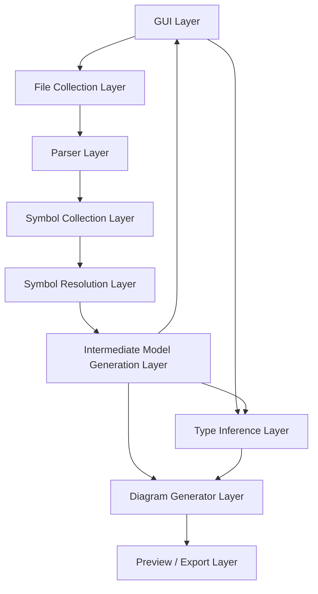

# レイヤー間インタフェース設計書

## 1. 文書目的

本書は、以下 2 資料のみを根拠として、UML自動生成ツールにおける各レイヤー間の入出力契約を定義するものである。

- リポジトリ直下 `要件定義書.md`
- `基本設計/設計優先度_対応内容_出力資料一覧.md`

本書の目的は、各レイヤーの責務境界を固定し、実装時に「どのレイヤーが何を受け取り、何を返すか」「どこまでの情報にアクセスしてよいか」を曖昧にしないことである。

---

## 2. 本書の適用範囲

本書で定義する対象は以下の実行レイヤーである。

1. GUI Layer
2. File Collection Layer
3. Parser Layer
4. Symbol Collection Layer
5. Symbol Resolution Layer
6. Intermediate Model Generation Layer
7. Type Inference Layer
8. Diagram Generator Layer
9. Preview / Export Layer

なお、`基本設計/設計優先度_対応内容_出力資料一覧.md` に記載された優先度3「レイヤ間インターフェース」の具体化として、主に以下の契約を定義する。

- Parser
- Collector
- Resolver
- Adapter / Model Builder
- Inferer
- Generator

---

## 3. 設計前提

## 3.1 スコープ前提

- 初版の実装言語は Python のみとする。
- 初版の解析対象言語は Python のみとする。
- 初版の対象図はクラス図、モジュール依存図、シーケンス図とする。
- 初版の出力記法は PlantUML のみとする。
- 外部ライブラリは初版では図上非表示とする。
- 起点関数は初版では 1 件のみとする。

## 3.2 モデル前提

- 中間モデルは単一の共通中間モデルを採用する。
- 中間モデルの骨格は初版で確定し、将来拡張時も破壊的変更を行わない。
- シンボル解決と型推論は別工程とする。
- Generator は AST ではなく中間モデルのみを参照する。
- 型不明は `Unknown`、未解決参照は `unresolved` として保持し、破棄しない。
- 内部識別子は UUID を正本とする。
- シンボル解決用名称は `canonical_name`、図出力用名称は派生表示名として扱う。

---

## 4. レイヤー構成と依存方向

## 4.1 依存の原則

- 下流レイヤーは、原則として直前レイヤーが公開する契約データのみを参照する。
- 下流レイヤーが上流レイヤーの内部表現に直接依存してはならない。
- 将来の多言語対応時は、言語依存差分を Parser / Resolver / Adapter 側で吸収し、Generator 側へ持ち込まない。

## 4.2 データ受け渡しの原則

- 各レイヤーの出力は、**正規の出力データ + Diagnostic 群**を必ず含む。
- 致命的失敗でない限り、部分結果を返して次工程へ進める。
- レイヤー間で受け渡すデータは、原則として型付き dataclass で表現する。
- 言語依存情報は Extension 系 dataclass に閉じ込め、生の `dict[str, Any]` へ逃がさない。

---

## 5. AST 参照境界

## 5.1 境界方針

AST の漏洩は多言語対応と責務分離を壊しやすいため、**生の AST 参照は Parser Layer 内に閉じ込める**ことを本書の原則とする。

## 5.2 各レイヤーの AST 参照可否

| レイヤー | 生AST参照 | 説明 |
|---|---:|---|
| GUI Layer | 不可 | GUI は解析設定と結果表示のみ扱う。 |
| File Collection Layer | 不可 | ファイル列挙のみ行う。 |
| Parser Layer | 可 | Python AST の生成と構文抽出を担う。 |
| Symbol Collection Layer | 不可 | Parser が出力した構文事実のみを利用する。 |
| Symbol Resolution Layer | 不可 | Symbol / Scope / Reference と補助情報のみ参照する。 |
| Intermediate Model Generation Layer | 不可 | 正規化対象は収集済み・解決済みデータのみとする。 |
| Type Inference Layer | 不可 | ProjectModel、Behavior IR、Resolution 結果のみ参照する。 |
| Diagram Generator Layer | 不可 | 中間モデルのみ参照する。 |
| Preview / Export Layer | 不可 | 生成済み PlantUML テキストのみ扱う。 |

## 5.3 Parser の責務

Parser は生 AST を保持してよい唯一の層であり、後続層が必要とする以下の情報へ変換して公開する責務を持つ。

- 宣言候補
- 参照候補
- import / alias 情報
- 制御構造情報
- Behavior IR 構築に必要な構文情報
- Extension に退避すべき言語依存補助情報

---

## 6. 共通インタフェース規約

## 6.1 共通レスポンス包み

すべての出力契約は、概念上以下の共通構造を持つものとする。

| 項目 | 型 | 説明 |
|---|---|---|
| `request_id` | UUID | 1回の解析要求を識別する。 |
| `payload` | 任意 dataclass | 当該レイヤーの正規出力。 |
| `diagnostics` | list[Diagnostic] | 当該レイヤーで発生した診断。 |
| `is_partial` | bool | 部分成功かどうか。 |

## 6.2 Diagnostic 規約

- `ERROR`: 当該単位の継続困難な失敗。
- `WARNING`: 継続可能だが精度低下がある事象。
- `INFO`: 未対応構文スキップや補足情報。

## 6.3 Unknown / unresolved 規約

- 型不明は `TypeRef(UNKNOWN)` で保持する。
- 参照未解決は `ResolutionCandidate` 0 件または `status=unresolved` で保持する。
- 下流レイヤーは Unknown / unresolved を見つけても原則として異常終了しない。

## 6.4 名前・ID 規約

- レイヤー間での識別は UUID を正本とする。
- 表示名ベースの照合は行わない。
- シンボル解決には `canonical_name` を使用する。
- 図表示名は Generator が派生生成する。

---

## 7. レイヤー間インタフェース一覧

| IF-ID | 提供レイヤー | 利用レイヤー | 主出力 | 主目的 |
|---|---|---|---|---|
| IF-01 | GUI Layer | File Collection Layer | `AnalysisRequest` | 実行条件を解析系へ渡す。 |
| IF-02 | File Collection Layer | Parser Layer | `CollectedSourceSet` | 解析対象ファイル集合を渡す。 |
| IF-03 | Parser Layer | Symbol Collection Layer | `ParsedSyntaxSet` | 宣言候補・参照候補・制御構造候補を渡す。 |
| IF-04 | Symbol Collection Layer | Symbol Resolution Layer | `CollectedSymbolSet` | Symbol / Scope / SymbolReference を渡す。 |
| IF-05 | Symbol Resolution Layer | Intermediate Model Generation Layer | `ResolvedSymbolSet` | 解決候補を付与した参照情報を渡す。 |
| IF-06 | Intermediate Model Generation Layer | GUI Layer | `EntryPointCandidateSet` | 起点関数候補を GUI 表示する。 |
| IF-07 | GUI Layer | Type Inference Layer | `InferenceRequest` | 選択済み起点関数と推論条件を渡す。 |
| IF-08 | Intermediate Model Generation Layer | Type Inference Layer | `ProjectModel` | 解決済み中間モデルを推論へ渡す。 |
| IF-09 | Intermediate Model Generation Layer | Diagram Generator Layer | `DiagramSourceModel` | 推論不要な図生成へ中間モデルを渡す。 |
| IF-10 | Type Inference Layer | Diagram Generator Layer | `DiagramSourceModel` | 推論結果を反映した中間モデルを渡す。 |
| IF-11 | Diagram Generator Layer | Preview / Export Layer | `GeneratedDiagramSet` | PlantUML テキストを表示・保存へ渡す。 |

---

## 8. 契約データ定義

## 8.1 `AnalysisRequest`

GUI から解析処理へ渡す要求。

| 項目 | 型 | 必須 | 説明 |
|---|---|---:|---|
| `request_id` | UUID | ○ | 解析要求 ID。 |
| `target_root_path` | str | ○ | 解析対象親ディレクトリ。 |
| `output_dir` | str | ○ | `.puml` 保存先。 |
| `diagram_types` | set[str] | ○ | `class` / `module_dependency` / `sequence`。 |
| `enable_type_inference` | bool | ○ | 型推論実施有無。 |
| `selected_entry_point_symbol_id` | UUID \| None | △ | 起点関数選択後のみ設定。 |
| `config_snapshot` | AnalysisOptionSnapshot | △ | 固定設定の取り込み結果。 |

## 8.2 `CollectedSourceSet`

File Collection Layer の出力。

| 項目 | 型 | 説明 |
|---|---|---|
| `project_root_path` | str | 解析対象ルート。 |
| `files` | list[CollectedSourceFile] | 収集済み Python ファイル一覧。 |

### `CollectedSourceFile`

| 項目 | 型 | 説明 |
|---|---|---|
| `source_unit_id` | UUID | SourceUnit の先行識別子。 |
| `file_path` | str | 実ファイルパス。 |
| `module_path_hint` | str | モジュール推定名。 |
| `language` | str | 初版では `PYTHON` 固定。 |

## 8.3 `ParsedSyntaxSet`

Parser Layer の出力。

| 項目 | 型 | 説明 |
|---|---|---|
| `parsed_units` | list[ParsedSourceUnit] | ファイルごとの構文抽出結果。 |
| `unsupported_constructs` | list[UnsupportedConstructRecord] | 未対応構文記録。 |

### `ParsedSourceUnit`

| 項目 | 型 | 説明 |
|---|---|---|
| `source_unit_id` | UUID | 対応する SourceUnit ID。 |
| `file_path` | str | 元ファイルパス。 |
| `module_path` | str | 正規化済みモジュールパス。 |
| `import_records` | list[ImportRecord] | import / alias / relative import 情報。 |
| `declaration_records` | list[DeclarationRecord] | class / def / 変数 / property などの宣言候補。 |
| `reference_records` | list[ReferenceRecord] | 名前参照・属性参照・呼び出し参照候補。 |
| `behavior_records` | list[BehaviorRecord] | IF / LOOP / CALL / ASSIGN / RETURN / CREATE の構文候補。 |
| `extension_records` | list[Python*Extension] | Python 固有補助情報。 |

## 8.4 `CollectedSymbolSet`

Symbol Collection Layer の出力。

| 項目 | 型 | 説明 |
|---|---|---|
| `source_units` | list[SourceUnit] | ソース単位一覧。 |
| `scopes` | list[Scope] | module / class / callable / block スコープ。 |
| `symbols` | list[Symbol] | 収集済みシンボル。 |
| `references` | list[SymbolReference] | 収集済み参照。 |
| `reference_bind_hints` | list[ReferenceBindHint] | resolver 用補助ヒント。 |

## 8.5 `ResolvedSymbolSet`

Symbol Resolution Layer の出力。

| 項目 | 型 | 説明 |
|---|---|---|
| `source_units` | list[SourceUnit] | 引き継ぎ。 |
| `scopes` | list[Scope] | 引き継ぎ。 |
| `symbols` | list[Symbol] | 引き継ぎ。 |
| `references` | list[SymbolReference] | 引き継ぎ。 |
| `resolution_candidates` | list[ResolutionCandidate] | 各参照に対する 0 件以上の解決候補。 |

## 8.6 `ProjectModel`

Intermediate Model Generation Layer の正規出力。

本書では、要件定義書に定義された以下を含む完全な中間モデルを `ProjectModel` として扱う。

- CoreModel
- Semantic Payload Layer
- Behavior IR Layer
- Language Extension Layer
- Inference Layer
- Analysis Support Layer

## 8.7 `EntryPointCandidateSet`

起点関数候補の GUI 表示用出力。

| 項目 | 型 | 説明 |
|---|---|---|
| `candidates` | list[CandidateEntryPoint] | GUI 表示候補。 |
| `selection_mode` | str | 初版では `single_select` 固定。 |

## 8.8 `InferenceRequest`

GUI と Model Layer の情報を合わせて Inferer へ渡す要求。

| 項目 | 型 | 説明 |
|---|---|---|
| `request_id` | UUID | 解析要求 ID。 |
| `project_model` | ProjectModel | 解決済み中間モデル。 |
| `entry_point_symbol_id` | UUID | 選択済み起点関数。 |
| `trace_sequence` | bool | シーケンス追跡有無。 |
| `inference_options` | AnalysisOptionSnapshot | 推論条件スナップショット。 |

## 8.9 `DiagramSourceModel`

Diagram Generator Layer の入力。

| 項目 | 型 | 説明 |
|---|---|---|
| `project_model` | ProjectModel | Generator が参照する唯一のモデル。 |
| `selected_diagram_types` | set[str] | 出力対象図種。 |
| `render_options` | AnalysisOptionSnapshot | 表示・出力設定。 |

補足:
- 推論未実施の場合は、TypeFact が空でもよい。
- シーケンス図生成時は、必要な `CallTraceStep` または等価な派生結果が `ProjectModel` 内に格納済みであること。

## 8.10 `GeneratedDiagramSet`

Diagram Generator Layer の出力。

| 項目 | 型 | 説明 |
|---|---|---|
| `artifacts` | list[GeneratedDiagram] | 図ごとの生成結果。 |

### `GeneratedDiagram`

| 項目 | 型 | 説明 |
|---|---|---|
| `diagram_type` | str | `class` / `module_dependency` / `sequence`。 |
| `format` | str | 初版では `plantuml` 固定。 |
| `text` | str | PlantUML 本文。 |
| `output_filename` | str | 保存時ファイル名。 |

---

## 9. インタフェース詳細

## 9.1 IF-01 GUI Layer → File Collection Layer

## 目的

解析の開始条件を下流へ渡す。

## 入力

- `AnalysisRequest`

## 出力

- `AnalysisRequest` をそのまま起点として処理開始
- 入力値不正時は `CONFIG` / `GUI` 系 Diagnostic を返す

## 契約上の注意

- GUI はファイル列挙ロジックを持たない。
- GUI は解析対象ルートと出力条件を渡すだけに留める。

## 9.2 IF-02 File Collection Layer → Parser Layer

## 目的

解析対象ファイル集合を Parser に引き渡す。

## 入力

- `AnalysisRequest`

## 出力

- `CollectedSourceSet`

## 契約上の注意

- 対象はプロジェクト配下の Python ファイルのみ。
- 外部ライブラリは収集対象に含めない。
- ファイル未読込や権限異常は Diagnostic に記録し、可能な範囲で継続する。

## 9.3 IF-03 Parser Layer → Symbol Collection Layer

## 目的

Python AST から抽出した構文事実を Collector に渡す。

## 入力

- `CollectedSourceSet`

## 出力

- `ParsedSyntaxSet`

## 契約上の注意

- Collector は AST オブジェクトを受け取らない。
- Parser は `class` / `def` / `import` / 継承 / 属性代入 / `if` / `for` / `while` / `return` / 関数呼び出し / クラス生成 / `@property` / `@classmethod` / `@staticmethod` に必要な情報を抽出する。
- 初版対象外構文は `UnsupportedConstructRecord` と `Diagnostic(INFO)` に記録する。

## 9.4 IF-04 Symbol Collection Layer → Symbol Resolution Layer

## 目的

宣言・スコープ・参照を整理したシンボル集合を Resolver へ渡す。

## 入力

- `ParsedSyntaxSet`

## 出力

- `CollectedSymbolSet`

## 契約上の注意

- Collector は `Symbol`、`Scope`、`SymbolReference` の一次生成を担う。
- Resolver が後続で解決可能なように、owner / scope / span / usage_kind を必ず埋める。
- `self.xxx` / `cls.xxx` 解決に必要な receiver 情報は `SymbolReference` または `ReferenceBindHint` に保持する。

## 9.5 IF-05 Symbol Resolution Layer → Intermediate Model Generation Layer

## 目的

解決候補付きの参照情報を Model Builder へ渡す。

## 入力

- `CollectedSymbolSet`

## 出力

- `ResolvedSymbolSet`

## 契約上の注意

- 1 参照に対して 0 件以上の `ResolutionCandidate` を保持する。
- 未解決でもエラー終了せず、`unresolved` として後続へ渡す。
- import 解決、alias 解決、scope 解決、qualified name 解決、`self.xxx` / `cls.xxx` 解決、相対 import 解決を対象とする。

## 9.6 IF-06 Intermediate Model Generation Layer → GUI Layer

## 目的

起点関数候補を GUI に表示する。

## 入力

- `ResolvedSymbolSet`

## 出力

- `ProjectModel`
- `EntryPointCandidateSet`

## 契約上の注意

- Model Generation Layer は `Symbol / Payload / TypeRef / Behavior IR / Diagnostic` を正規化する。
- 起点関数候補は `CandidateEntryPoint` として ProjectModel と整合する `symbol_id` を返す。
- クラス図・依存図のみ生成する場合は、候補選択をスキップしてもよい。

## 9.7 IF-07 GUI Layer → Type Inference Layer

## 目的

ユーザが GUI で選択した起点関数を推論・追跡処理へ渡す。

## 入力

- `selected_entry_point_symbol_id`
- `enable_type_inference`
- 対象図種

## 出力

- `InferenceRequest`

## 契約上の注意

- 初版では単一選択のみ許容する。
- GUI が保持するのは `symbol_id` であり、表示名文字列ではない。

## 9.8 IF-08 Intermediate Model Generation Layer → Type Inference Layer

## 目的

解決済み中間モデルを Inferer に渡す。

## 入力

- `ProjectModel`
- `InferenceRequest`

## 出力

- TypeFact / SymbolBindingFact / CallTraceStep が反映された `ProjectModel`

## 契約上の注意

- Inferer は宣言型を破壊的に上書きしない。
- 推論結果は `TypeFact` として蓄積する。
- 分岐・ループは `Behavior IR` を用いて追跡する。
- 再帰・循環検知時は note 用情報を残し、それ以上の追跡は中断する。

## 9.9 IF-09 Intermediate Model Generation Layer → Diagram Generator Layer

## 目的

推論を必要としない図生成へ中間モデルを渡す。

## 入力

- `DiagramSourceModel(project_model=ProjectModel)`

## 出力

- `GeneratedDiagramSet`

## 契約上の注意

- クラス図・モジュール依存図は、推論未実施でも生成可能であること。
- Generator は AST や Parser 出力へ戻ってはならない。

## 9.10 IF-10 Type Inference Layer → Diagram Generator Layer

## 目的

推論結果と追跡結果を反映したモデルを Generator に渡す。

## 入力

- `DiagramSourceModel(project_model=InferredProjectModel)`

## 出力

- `GeneratedDiagramSet`

## 契約上の注意

- シーケンス図生成時は本インタフェースの利用を必須とする。
- `Unknown` や `Union` を含む場合も出力不能にせず、PlantUML へ表現可能な形へ変換する。
- participant 名の衝突解消は Generator 側の責務とする。

## 9.11 IF-11 Diagram Generator Layer → Preview / Export Layer

## 目的

PlantUML テキストを GUI プレビューと保存機能へ渡す。

## 入力

- `GeneratedDiagramSet`

## 出力

- GUI 表示用テキスト
- `.puml` 保存対象テキスト

## 契約上の注意

- 初版の正本出力は `.puml` とする。
- Preview / Export は図意味を解釈せず、生成済みテキストを扱うだけに留める。
- PNG / SVG は将来対応とする。

---

## 10. レイヤー別責務境界

| レイヤー | やること | やらないこと |
|---|---|---|
| GUI | 入力受付、候補表示、プレビュー、保存操作 | 解析ロジック、解決、推論 |
| File Collection | ファイル列挙、対象絞り込み | AST 解析、図生成 |
| Parser | AST 生成、構文候補抽出、Extension 用補助情報抽出 | シンボル解決、図生成 |
| Symbol Collection | Symbol / Scope / Reference 生成 | import 解決、型推論 |
| Symbol Resolution | 参照解決、候補付与 | 中間モデル正規化、図生成 |
| Intermediate Model Generation | ProjectModel 正規化、Behavior IR 構築、EntryPoint 抽出 | 生AST参照、図描画 |
| Type Inference | TypeFact 蓄積、CallTrace 生成 | 宣言構造の再生成 |
| Diagram Generator | ProjectModel から PlantUML 生成 | AST 参照、直接GUI操作 |
| Preview / Export | 表示と保存 | 解析、推論、図意味判断 |

---

## 11. 継続条件と失敗条件

## 11.1 継続を基本とする失敗

以下は Diagnostic を積んで継続する。

- 一部ファイルの parse 失敗
- import 未解決
- symbol 未解決
- 型不明
- 初版未対応構文検出
- 外部ライブラリ参照
- 再帰 / 循環検知による追跡停止

## 11.2 中断対象

以下は要求全体の中断対象とする。

- 解析対象ディレクトリ不正
- 出力先不正で保存不能、かつプレビューも不要な場合
- 起点関数必須のシーケンス図生成で選択不能

---

## 12. 実装上の推奨

## 12.1 インタフェース実装方針

- 各 IF は Python の dataclass または Protocol で表現する。
- レイヤーごとに `input_models.py` / `output_models.py` を分けてもよいが、循環参照を避ける。
- `ProjectModel` は共有コアモデルとして単一箇所に置き、各レイヤーはその参照のみを持つ。

## 12.2 モジュール分割推奨

- `parsers/` は `ParsedSyntaxSet` を正本出力とする。
- `collectors/` は `CollectedSymbolSet` を正本出力とする。
- `resolvers/` は `ResolvedSymbolSet` を正本出力とする。
- `adapters/` または `model_builders/` は `ProjectModel` を正本出力とする。
- `inferers/` は `ProjectModel` への Fact 追加を正本出力とする。
- `generators/` は `GeneratedDiagramSet` を正本出力とする。

---

## 13. 決定事項まとめ

- 生 AST は Parser Layer 内に閉じ込める。
- Collector 以降は Parser が抽出した構文事実のみを扱う。
- Resolver は 1 参照に対して 0 件以上の候補を返せる。
- Intermediate Model Generation Layer は `ProjectModel` を正本として生成する。
- 起点関数候補は `CandidateEntryPoint` として GUI に返し、GUI は `symbol_id` を保持する。
- Inferer は宣言型を上書きせず、`TypeFact` を蓄積する。
- Generator の入力は常に `ProjectModel` を含む `DiagramSourceModel` とする。
- Generator は中間モデルのみ参照し、AST や Parser 出力へ戻らない。
- Preview / Export は PlantUML テキストの表示と保存に専念する。

---

## 14. 今後の詳細化対象

本書で固定した契約を前提として、次段の詳細設計で詰めるべき対象は以下である。

- `ParsedSyntaxSet` 内の record 詳細項目
- `ReferenceBindHint` の正式構造
- `BehaviorRecord` から `BehaviorNode / BehaviorEdge` への変換規則
- 起点関数候補スコアリング詳細
- `CallTraceStep` の保持位置と正本 / 派生の扱い
- Generator ごとの図種別入力制約
- Diagnostic code 一覧
