# UML自動生成ツール 解析フロー詳細（図解版）

## 1. 目的
本資料は、要件定義書および中間モデル設計反映版をもとに、初版 Python 対応の**解析フロー詳細**を実装可能な粒度まで具体化し、さらに**図解できる箇所を Mermaid 記法で可視化**したものである。  
対象は以下とする。

- 解析対象言語: Python
- 出力対象: クラス図 / モジュール依存図 / シーケンス図
- 出力記法: PlantUML
- 実行形態: ローカル GUI アプリ

本資料では、要件定義上の大枠フローを以下の観点で詳細化する。

- 各工程の責務
- 各工程の入力 / 出力
- 工程間で受け渡す中間成果物
- Diagnostics / UnsupportedConstruct の扱い
- シーケンス図生成に向けた起点関数ベース追跡の流れ

---

## 2. 全体フロー

## 2.1 一覧

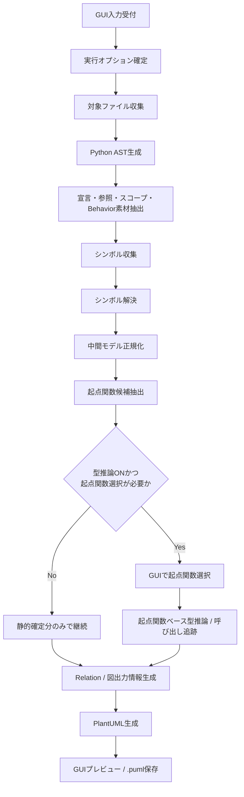

## 2.2 層ごとの責務分離

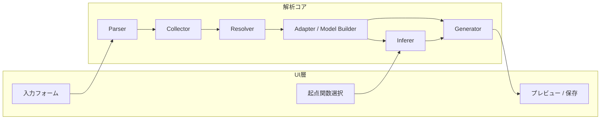

## 2.3 中間成果物の流れ

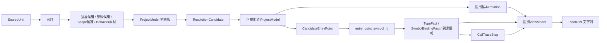

---

## 3. 解析フロー詳細

## 3.1 Phase 0: 実行要求受付

### 目的
GUI から解析条件を受け取り、1 回の解析実行に必要なオプションを確定する。

### 入力
- 解析対象ディレクトリ
- 出力先ディレクトリ
- 出力対象図
- 型推論実施有無
- 起点関数未確定状態
- `config.ini` の固定設定

### 主処理
- GUI 入力値の検証
- パスの存在確認
- Python 解析以外が指定されていないことの確認
- 解析単位の `AnalysisOptionSnapshot` 作成

### 出力
- `AnalysisOptionSnapshot`
- 解析ジョブコンテキスト
- 初期 `Diagnostic`

### この段階で持つべき情報
- 実行 ID
- 対象ディレクトリ
- 出力先
- 出力図種
- 型推論 ON/OFF
- GUI 表示用状態

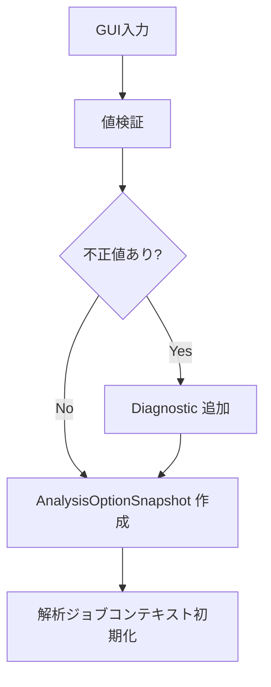

---

## 3.2 Phase 1: 対象ファイル収集

### 目的
解析対象ディレクトリ配下から Python ファイル一覧を収集し、`SourceUnit` 候補を作成する。

### 入力
- 解析対象ディレクトリ
- `config.ini`

### 主処理
- 配下ファイルの再帰走査
- 拡張子 `.py` のみ抽出
- パス正規化
- 将来的な除外設定に備えたフック位置の確保

### 出力
- 生ファイル一覧
- `SourceUnit` の最小候補
  - path
  - language = Python
  - module 候補名

### 失敗時
- ファイルアクセス不可は `WARNING` または `ERROR`
- 読み取り不可ファイルはスキップ継続を基本とする

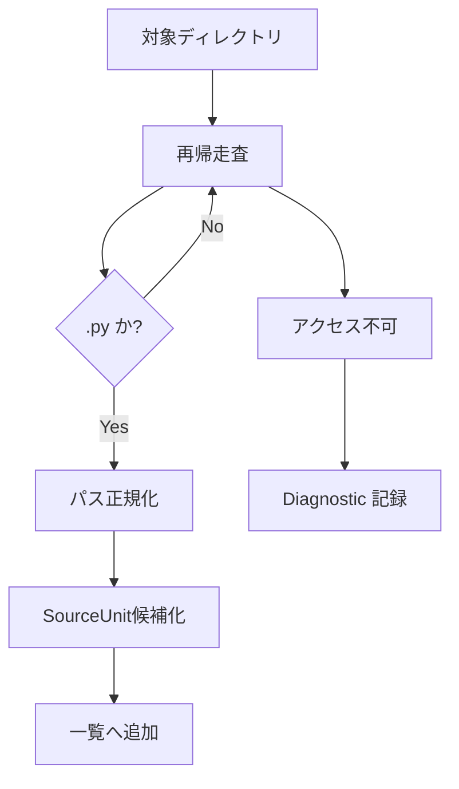

---

## 3.3 Phase 2: Python AST 生成

### 目的
各 Python ファイルを AST 化し、後続工程で必要な構文情報の基礎を得る。

### 入力
- ファイル一覧

### 主処理
- ファイル読込
- `ast.parse()` による AST 生成
- `SourceSpan` の初期採番
- import 文、class、def、代入、if、for、while、return、call、class 生成等の対象構文位置情報を取得
- 未対応構文の検知

### 出力
- ファイル単位 AST
- AST 由来の `SourceSpan`
- `UnsupportedConstructRecord`
- `Diagnostic(PARSE*)`

### 失敗時
- 当該ファイルの AST 生成失敗時は `PARSE` 系 `Diagnostic(ERROR)` を記録
- 他ファイルの解析は継続する

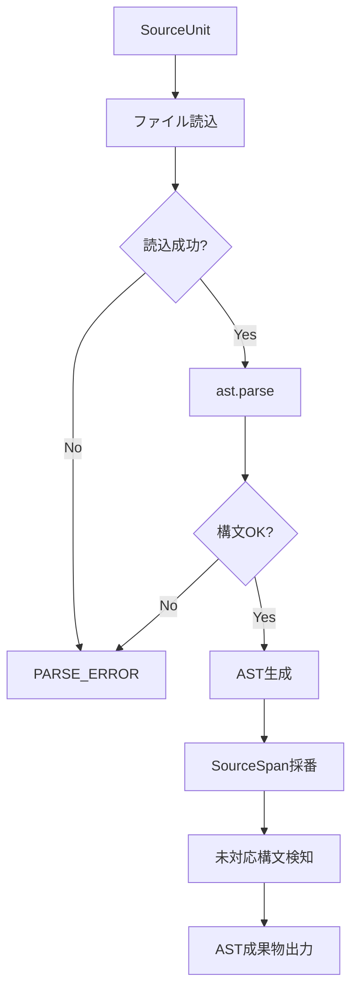

---

## 3.4 Phase 3: 宣言候補・参照候補・スコープ抽出

### 目的
AST をそのまま保持するのではなく、**宣言・参照・スコープ・Behavior IR 素材**へ分解する。

### 入力
- ファイル単位 AST
- `SourceUnit`

### 主処理
#### 宣言候補抽出
- `class` から型宣言候補を抽出
- `def` から Callable 候補を抽出
- 引数を Parameter 候補として抽出
- 属性代入を Field / Variable 候補として抽出
- `@property` / `@classmethod` / `@staticmethod` を modifier として抽出

#### 参照候補抽出
- import 参照
- 名前参照
- 属性参照
- 関数呼び出し参照
- クラス生成参照
- return 式参照

#### スコープ抽出
- module scope
- class scope
- callable scope
- block scope

#### Behavior 素材抽出
- CALL
- CREATE
- ASSIGN
- RETURN
- IF
- LOOP
- BLOCK

### 出力
- `Scope` 一覧
- `Symbol` の一次候補
- `SymbolReference` の一次候補
- `BehaviorNode` / `BehaviorEdge` の一次候補
- Python 固有 extension 候補

### ポイント
この段階では**まだ解決しない**。  
たとえば `foo()` がどの `foo` を指すか、`self.x` がどの FieldDecl か、`x` の型が何かは未確定のままでよい。

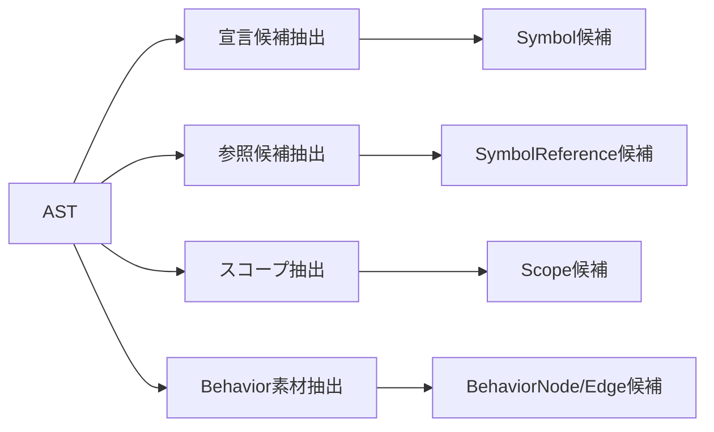

## 3.4.1 AST から何を抜くか

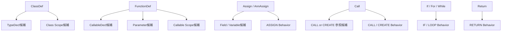

---

## 3.5 Phase 4: シンボル収集

### 目的
抽出した候補を `Symbol` / `Payload` 中心の共通中間表現へ整理し、プロジェクト全体の宣言台帳を作る。

### 入力
- 宣言候補
- スコープ候補
- `SourceUnit`

### 主処理
- `ProjectModel` を初期化
- `SourceUnit` 正式登録
- `Scope` 正式登録
- 各宣言候補に `symbol_id` を採番
- `Symbol` と `Payload` の紐付け
- `TypeDecl` / `CallableDecl` / `FieldDecl` / `PropertyDecl` / `VariableDecl` / `ParameterDecl` を生成
- `TypeRef(UNKNOWN)` / `TypeRef(VOID)` / `TypeRef(ANY)` 等を Type Pool に用意
- 型ヒントが存在する箇所は `TypeRef` を先行生成

### 出力
- 宣言系が格納された `ProjectModel`
- Type Pool
- Payload 群
- 参照未解決状態の `SymbolReference`

### ここで確定するもの
- declaration の存在
- owner 関係
- scope 帰属
- canonical name の候補

### ここで未確定のもの
- import のリンク先
- alias の実体
- call 参照先
- `self.xxx` / `cls.xxx` の指し先
- 型推論結果

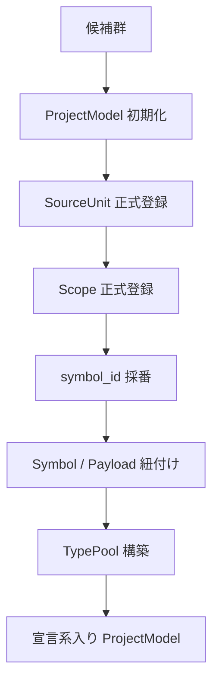

## 3.5.1 ProjectModel の見取り図

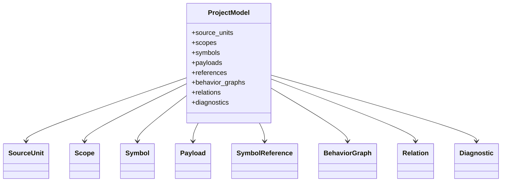

---

## 3.6 Phase 5: シンボル解決

### 目的
参照がどの定義を指すかを決定し、0 件以上の解決候補を `ResolutionCandidate` として保持する。

### 入力
- `ProjectModel`
- `SymbolReference`
- `Scope`
- import 情報
- Python extension 情報

### 主処理
#### import 解決
- `import a.b`
- `from a import b`
- 相対 import
- alias import

#### 名前解決
- ローカル変数
- 引数
- クラスメンバ
- モジュールメンバ
- 組み込み名
- 同名シンボル競合時の優先順位付け

#### 属性解決
- `self.xxx`
- `cls.xxx`
- `module.symbol`
- `obj.method` のうち、静的に確定できる部分

#### 候補評価
- 候補 0 件も許容
- 候補複数件も許容
- `confidence` / `reason` / `rank` を付与

### 出力
- `ResolutionCandidate` 一覧
- `Diagnostic(RESOLVE*)`
- 未解決参照を含む `ProjectModel`

### ポイント
- **解決候補の保持**が重要で、ここで 1 件に潰しきれなくてもよい
- シンボル解決は「参照先の候補を特定する工程」であり、型確定とは分ける

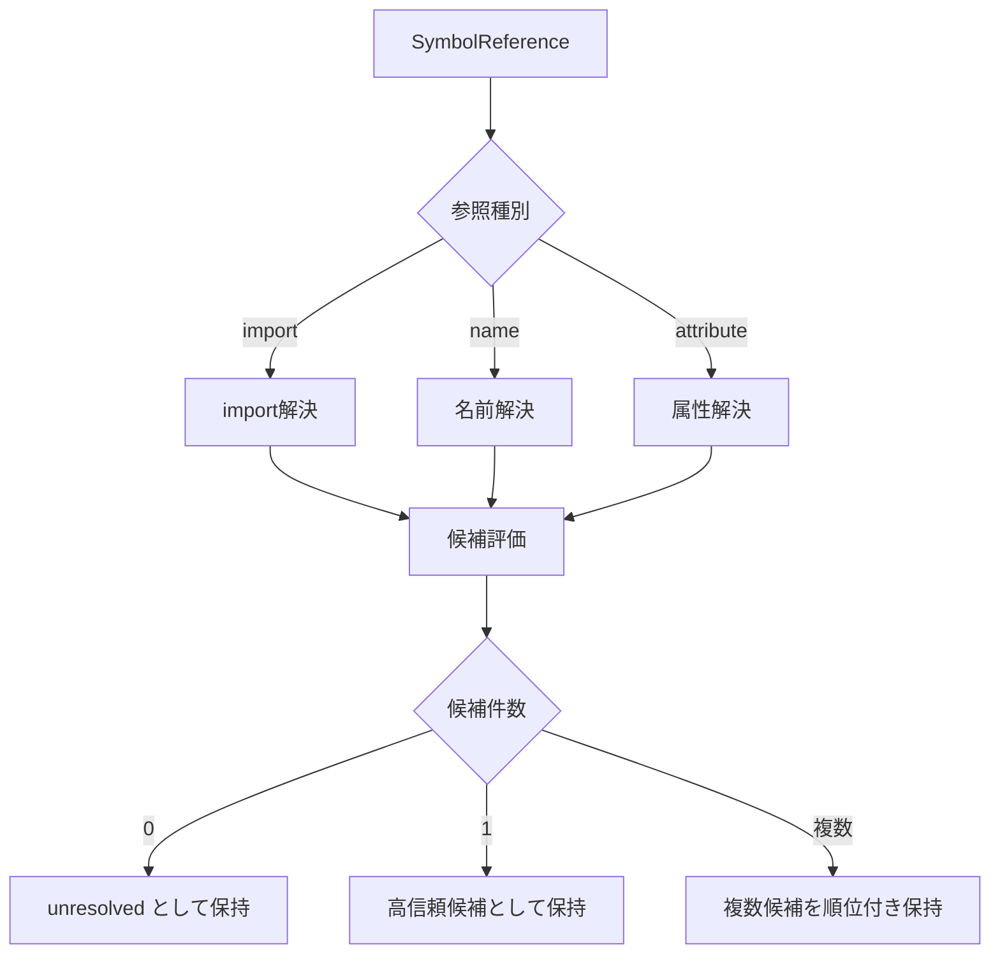

## 3.6.1 解決の優先イメージ

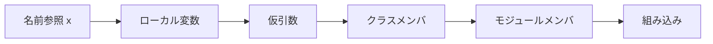

---

## 3.7 Phase 6: 中間モデル正規化

### 目的
宣言・参照・解決結果・Behavior を、Generator が読みやすい統一モデルに整える。

### 入力
- `ProjectModel`
- `ResolutionCandidate`
- `Behavior` 一次候補

### 主処理
- `BehaviorGraph` 正式生成
- `BehaviorNode` / `BehaviorEdge` の整列
- `CallableDecl.behavior_graph_id` の確定
- `SymbolReference.receiver_ref_id` / `arg_index` / `usage_kind` の補正
- `Relation` のうち基本関係を materialize
  - DECLARES
  - EXTENDS
  - IMPORTS
  - CALLS の静的確定分
  - CREATES の静的確定分
  - RETURNS / PARAM_TYPE / HAS_A の静的確定分
- Unknown を明示的に `TypeRef(UNKNOWN)` へ寄せる
- 各種 `Diagnostic(MODEL*)` 記録

### 出力
- 正規化済 `ProjectModel`
- `BehaviorGraph` 群
- 基本 `Relation` 群

### 中間モデル生成完了条件
以下がそろっていれば完了とみなす。

- `SourceUnit` がある
- `Scope` がある
- `Symbol` と Payload がある
- `SymbolReference` がある
- `ResolutionCandidate` がある、または未解決として記録されている
- `BehaviorGraph` がある
- 型不明は `Unknown` として保持されている

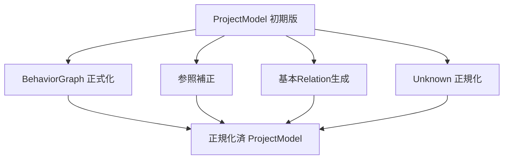

---

## 3.8 Phase 7: 起点関数候補抽出

### 目的
シーケンス図生成や型推論の起点となる Callable を GUI 選択可能な形で列挙する。

### 入力
- 正規化済 `ProjectModel`

### 主処理
- トップレベル関数や `if __name__ == "__main__":` 配下呼び出し候補の抽出
- public に見える関数 / メソッド候補の抽出
- 引数数、所在モジュール、クラス名、定義位置行番号を整理
- スコアリングして `CandidateEntryPoint` を生成

### 出力
- `CandidateEntryPoint` 一覧

### GUI 側要件
- 一覧表示は完全修飾名の手入力を要求しない
- モジュール名 / クラス名 / 関数名 / 行番号で識別できること

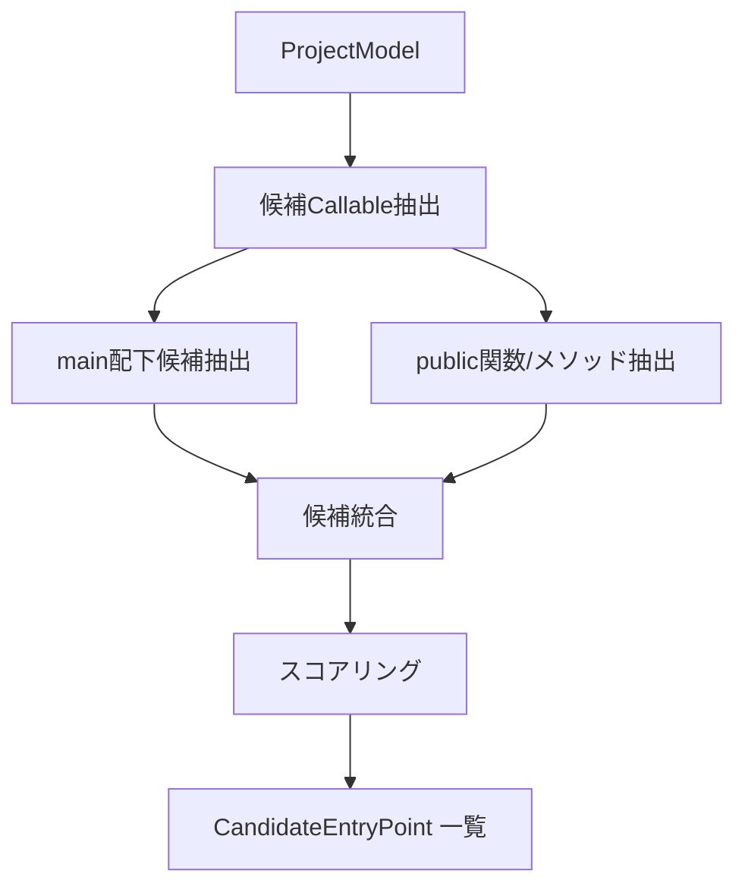

---

## 3.9 Phase 8: 起点関数選択

### 目的
ユーザに起点関数を 1 件選ばせ、追跡対象を確定する。

### 分岐
#### 型推論 OFF
- シーケンス図を生成しない、または静的確定分のみ生成
- このフェーズをスキップ可能

#### 型推論 ON
- GUI で 1 件選択
- 選択結果を解析コンテキストへ反映

### 出力
- 選択済 `entry_point_symbol_id`

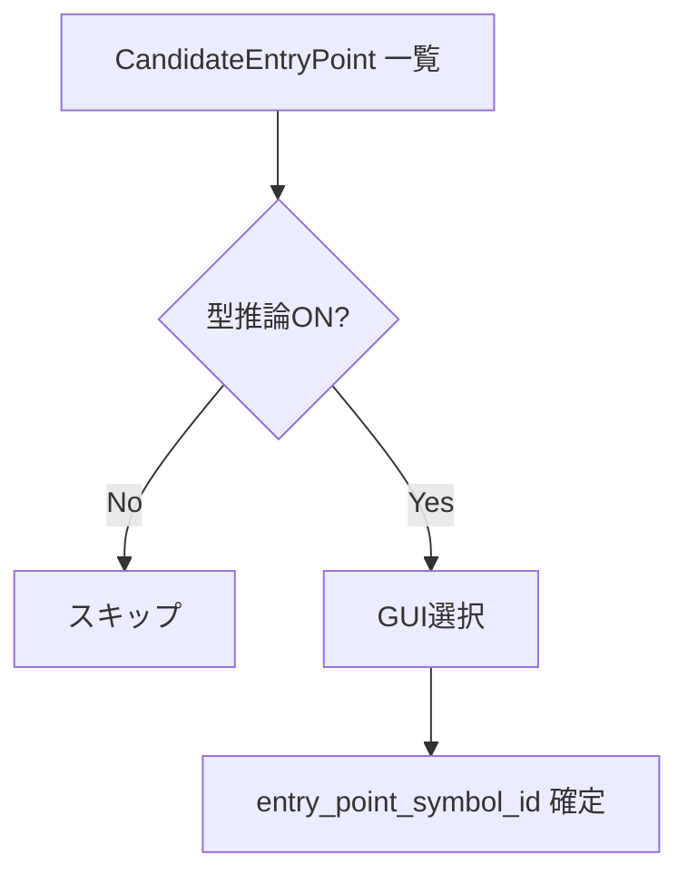

---

## 3.10 Phase 9: 起点関数ベース型推論

### 目的
起点関数から到達可能な経路を追跡し、変数・属性・引数・戻り値の型事実を蓄積する。

### 入力
- `entry_point_symbol_id`
- `BehaviorGraph`
- `ResolutionCandidate`
- 宣言型情報
- `TypeRef`

### 主処理
#### 初期環境生成
- 引数の declared type を初期事実として投入
- `self` / `cls` を owner type に束縛

#### ASSIGN の処理
- `x = Sample2()` → `x: Sample2`
- `self.a = x` → `self.a` に x の型事実を継承
- `y = x` → y に x の型事実を継承

#### CALL / CREATE の処理
- 呼び出し先候補を取得
- 実引数 → 仮引数の束縛を `SymbolBindingFact` として保持
- 戻り値型を呼び出し元変数へ伝搬
- コンストラクタ呼び出しは生成型を確定しやすい強い事実として扱う

#### RETURN の処理
- return 式の型を callable の戻り値事実として追加

#### IF の処理
- `isinstance(x, A)` を見つけたら分岐内で `x: A`
- else 側では否定条件のまま保持するか、初版では弱い情報として扱う
- 分岐ごとに環境を分岐させ、合流時に Union 化を許容

#### LOOP の処理
- ループ構造を保持
- 初版では経路爆発回避のため反復回数は制御する
- 型事実は単調増加を基本とし、一定条件で収束判定する

### 出力
- `TypeFact` 一覧
- `TypeConstraint` 一覧
- `SymbolBindingFact` 一覧
- 呼び出し追跡用の到達情報
- `Diagnostic(INFER*)`

### ポイント
- 宣言型を破壊せず、事実を追加する
- 候補が複数ある場合は `Union` を許容する
- 不明は不明のまま残し、捏造しない

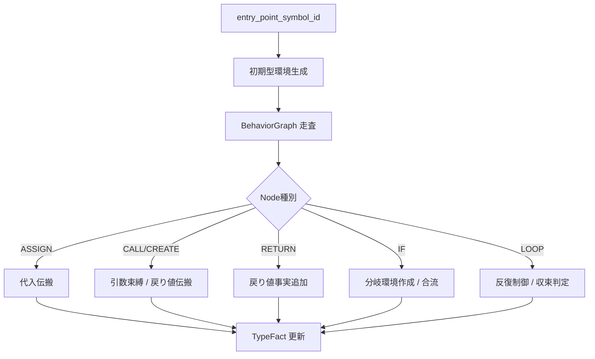

## 3.10.1 分岐時の型環境イメージ

```mermaid
flowchart TD
    A[現在の型環境] --> B{isinstance(x, Sample2)}
    B -- True --> C[True側環境: x = Sample2]
    B -- False --> D[False側環境: x = Unknown or 既存候補]
    C --> E[分岐内解析]
    D --> F[分岐内解析]
    E --> G[環境合流]
    F --> G
    G --> H[x = Union(...)]
```

## 3.10.2 代入・呼び出し・戻り値伝搬のイメージ

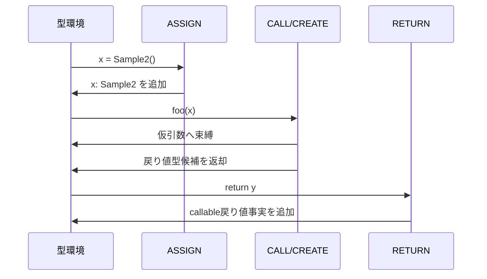

---

## 3.11 Phase 10: 呼び出し追跡 / シーケンス用派生情報生成

### 目的
起点関数から到達可能な呼び出し経路を `CallTraceStep` として組み立て、シーケンス図へ落とせる形にする。

### 入力
- `BehaviorGraph`
- `ResolutionCandidate`
- `TypeFact`
- `entry_point_symbol_id`

### 主処理
- 起点関数から DFS / BFS ベースで呼び出し追跡
- 再帰検知
- 循環呼び出し検知
- 分岐時の `branch_condition` 保持
- ループ時の `loop_context` 保持
- 呼び出し先 participant の決定
- 外部ライブラリ呼び出しは初版では participant 非表示

### 出力
- `CallTraceStep` 一覧
- シーケンス図用補助構造
- `Diagnostic(GENERATE*)` の前段素材

### 再帰 / 循環時の扱い
- 同一経路上で再訪した callable は再帰・循環として検知
- 初版では note 表示用情報を残し、それ以上の深追いは停止する

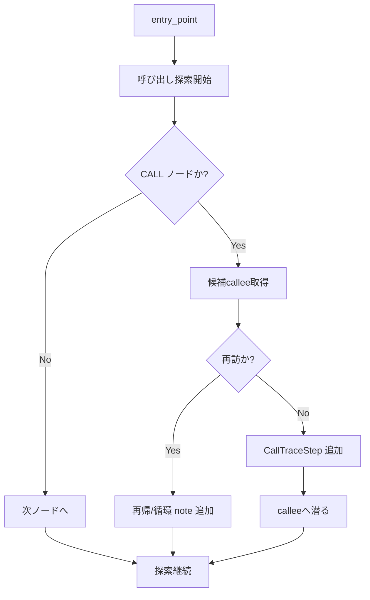

## 3.11.1 シーケンス図素材の生成イメージ

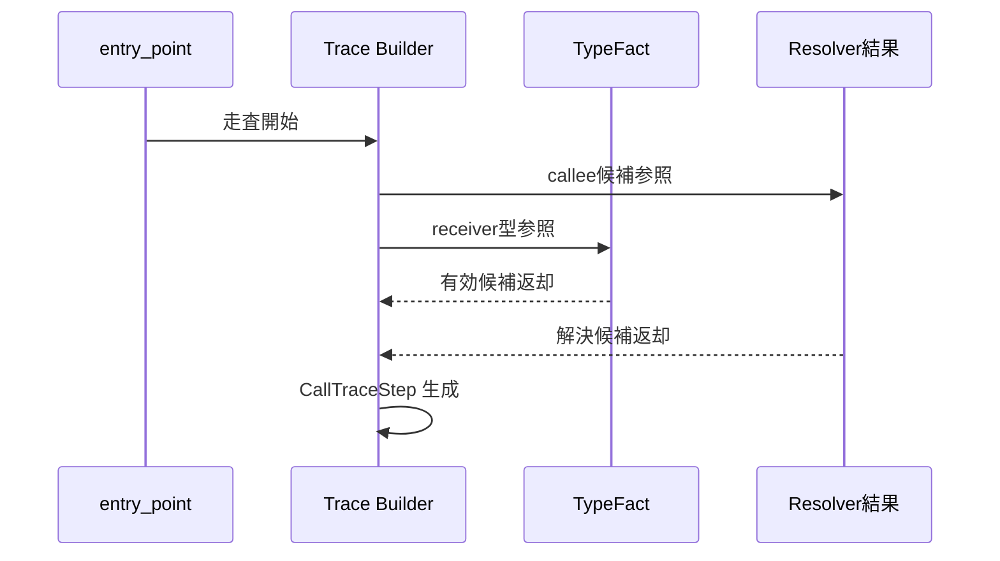

---

## 3.12 Phase 11: Relation 補完と図別ビュー生成

### 目的
図種ごとに必要な情報を `ProjectModel` から取り出しやすい形へ変換する。

### 入力
- `ProjectModel`
- `TypeFact`
- `CallTraceStep`

### 主処理
#### クラス図向け
- TypeDecl / FieldDecl / PropertyDecl / CallableDecl の整理
- `EXTENDS` / `HAS_A` / `USES` / `RETURNS` / `PARAM_TYPE` の確定・補完
- Unknown 型の表示判断

#### モジュール依存図向け
- `IMPORTS` / `USES` / `CALLS` をモジュール粒度へ集約

#### シーケンス図向け
- `CallTraceStep` から participant / message / alt / loop / return を構築
- 表示名衝突を解消

### 出力
- 図別 ViewModel

```mermaid
flowchart LR
    A[ProjectModel] --> B[ClassDiagram ViewModel]
    A --> C[ModuleDependency ViewModel]
    A --> D[SequenceDiagram ViewModel]
    E[TypeFact] --> B
    E --> D
    F[CallTraceStep] --> D
```

## 3.12.1 図種ごとの入力差分

```mermaid
flowchart TD
    A[共通中間モデル] --> B{図種}
    B -->|クラス図| C[型・属性・継承・使用関係]
    B -->|モジュール依存図| D[import / uses / calls 集約]
    B -->|シーケンス図| E[call trace / alt / loop / return]
```

---

## 3.13 Phase 12: PlantUML 生成

### 目的
図別 ViewModel を PlantUML テキストへ変換する。

### 入力
- 図別 ViewModel

### 主処理
- クラス図 PlantUML 生成
- モジュール依存図 PlantUML 生成
- シーケンス図 PlantUML 生成
- 表示名短縮
- 衝突時の表示名再展開
- Unknown / Union / unresolved の表記制御

### 出力
- `.puml` 文字列
- 図種別生成結果
- `Diagnostic(GENERATE*)`

```mermaid
flowchart TD
    A[図別 ViewModel] --> B{図種}
    B -->|クラス図| C[class 用テンプレート適用]
    B -->|依存図| D[module 用テンプレート適用]
    B -->|シーケンス図| E[sequence 用テンプレート適用]
    C --> F[表示名調整]
    D --> F
    E --> F
    F --> G[PlantUML 文字列]
```

---

## 3.14 Phase 13: GUI プレビュー / 保存

### 目的
ユーザに生成結果を確認させ、`.puml` として保存可能にする。

### 入力
- PlantUML 文字列
- Diagnostics

### 主処理
- GUI プレビュー表示
- 図切替表示
- 保存先への書き込み
- エラー / Warning / Info の表示

### 出力
- `.puml` ファイル
- GUI 表示結果
- 実行ログ

```mermaid
flowchart TD
    A[PlantUML文字列] --> B[プレビュー表示]
    A --> C[保存処理]
    D[Diagnostics] --> B
    D --> E[メッセージ表示]
    C --> F[.puml ファイル]
```

---

## 4. 工程別 入出力一覧

| Phase | 主担当層 | 主入力 | 主出力 |
|---|---|---|---|
| 0 | GUI | GUI入力, config.ini | AnalysisOptionSnapshot |
| 1 | File Collection | 対象ディレクトリ | Pythonファイル一覧, SourceUnit候補 |
| 2 | Parser | Pythonファイル | AST, SourceSpan, PARSE Diagnostic |
| 3 | Parser / Collector | AST | Scope候補, Symbol候補, Reference候補, Behavior素材 |
| 4 | Symbol Collection | 候補群 | ProjectModelの宣言系, TypePool |
| 5 | Resolver | ProjectModel, Reference | ResolutionCandidate, RESOLVE Diagnostic |
| 6 | Adapter / Model Builder | 宣言系, 解決結果, Behavior素材 | 正規化済ProjectModel, BehaviorGraph, 基本Relation |
| 7 | Support | ProjectModel | CandidateEntryPoint |
| 8 | GUI | CandidateEntryPoint | entry_point_symbol_id |
| 9 | Inferer | EntryPoint, BehaviorGraph, ResolutionCandidate | TypeFact, TypeConstraint, SymbolBindingFact |
| 10 | Inferer / Generator前処理 | TypeFact, BehaviorGraph | CallTraceStep |
| 11 | Generator前処理 | ProjectModel, TypeFact, CallTraceStep | 図別ViewModel |
| 12 | Generator | 図別ViewModel | PlantUML文字列 |
| 13 | GUI / Export | PlantUML文字列 | プレビュー, .puml |

## 4.1 Phase 間の依存関係

```mermaid
flowchart LR
    P0[0 受付] --> P1[1 ファイル収集]
    P1 --> P2[2 AST生成]
    P2 --> P3[3 候補抽出]
    P3 --> P4[4 シンボル収集]
    P4 --> P5[5 解決]
    P5 --> P6[6 正規化]
    P6 --> P7[7 起点候補抽出]
    P7 --> P8[8 起点選択]
    P6 --> P11[11 図別ViewModel]
    P8 --> P9[9 型推論]
    P9 --> P10[10 呼び出し追跡]
    P10 --> P11
    P11 --> P12[12 PlantUML生成]
    P12 --> P13[13 GUI保存]
```

---

## 5. 実装上の責務分割案

## 5.1 推奨クラス責務

| クラス/モジュール | 主責務 |
|---|---|
| `input_form.py` | 実行条件入力 |
| `python_parser.py` | AST生成と対象構文抽出 |
| `symbol_collector.py` | 宣言候補 / 参照候補 / Scope / Behavior素材の収集 |
| `python_symbol_resolver.py` | import, alias, scope, self/cls 解決 |
| `python_adapter.py` | 候補群から ProjectModel 正規化 |
| `python_type_inferer.py` | 起点関数ベース型推論, 呼び出し追跡 |
| `plantuml_generator.py` | ViewModel から PlantUML 生成 |
| `entry_point_selector.py` | 起点関数候補表示と選択 |
| `preview_panel.py` | 生成結果表示 |

## 5.2 重要な分離ポイント
- `Parser` は**構文を見るだけ**
- `Resolver` は**参照先候補を特定するだけ**
- `Inferer` は**型と到達経路を考えるだけ**
- `Generator` は**中間モデルを読むだけ**

この分離を崩すと、あとで多言語対応したときに地獄を見る。

## 5.3 モジュール境界イメージ

```mermaid
flowchart LR
    A[input_form.py] --> B[python_parser.py]
    B --> C[symbol_collector.py]
    C --> D[python_symbol_resolver.py]
    D --> E[python_adapter.py]
    E --> F[entry_point_selector.py]
    E --> G[python_type_inferer.py]
    E --> H[plantuml_generator.py]
    F --> G
    G --> H
    H --> I[preview_panel.py]
```

---

## 6. 代表的な 1 ファイル解析イメージ

以下のようなコードを想定する。

```python
class Sample2:
    def run(self) -> None:
        return

class Sample1:
    def __init__(self) -> None:
        self.sample2 = Sample2()

    def execute(self, x):
        if isinstance(x, Sample2):
            x.run()
        self.sample2.run()
```

### 流れ
1. `Sample2`, `Sample1` を `TypeDecl` として登録
2. `run`, `__init__`, `execute` を `CallableDecl` として登録
3. `self.sample2 = Sample2()` を
   - `BehaviorNode(ASSIGN)`
   - `BehaviorNode(CREATE)`
   - `FieldDecl(sample2)` 候補
   として抽出
4. `x.run()` と `self.sample2.run()` の参照を `SymbolReference` 化
5. `Sample2()` は constructor 呼び出しとして `CREATES` 候補を持つ
6. `self.sample2` は resolver により `Sample1.sample2` に結びつく
7. `isinstance(x, Sample2)` により IF ブロック内で `x: Sample2` の `TypeFact` を追加
8. `x.run()` はその分岐内で `Sample2.run` へ高信頼で束縛される
9. `self.sample2.run()` は `sample2: Sample2` の事実を用いて `Sample2.run` へ束縛される
10. シーケンス図では `alt` を伴う 2 本の `run()` 呼び出しとして出力できる

## 6.1 例コードの解析イメージ

```mermaid
flowchart TD
    A[Sample1.__init__] --> B[self.sample2 = Sample2()]
    B --> C[Field sample2 候補生成]
    B --> D[CREATE Sample2]
    A --> E[Sample1.execute(x)]
    E --> F{isinstance(x, Sample2)}
    F -- True --> G[x.run()]
    F -- Always --> H[self.sample2.run()]
    D --> I[sample2: Sample2 事実]
    I --> H
    F --> J[x: Sample2 事実]
    J --> G
```

## 6.2 例コードから出したいシーケンス図イメージ

```mermaid
sequenceDiagram
    participant S1 as Sample1.execute
    participant X as x: Sample2
    participant F as self.sample2: Sample2

    alt isinstance(x, Sample2)
        S1->>X: run()
        X-->>S1: return
    end

    S1->>F: run()
    F-->>S1: return
```

---

## 7. Diagnostics の流し方

## 7.1 基本方針
各フェーズは失敗しても、可能な限り後続へ進める。

## 7.2 フェーズ別例

| フェーズ | 代表コード | 例 |
|---|---|---|
| Parse | `PARSE_*` | 構文エラーで当該ファイルAST生成不可 |
| Resolve | `RESOLVE_*` | import先不明, self属性の候補不明 |
| Model | `MODEL_*` | Payload構築不整合 |
| Infer | `INFER_*` | 分岐追跡打ち切り, 型確定失敗 |
| Generate | `GENERATE_*` | participant名衝突, 図生成不能 |
| GUI | `GUI_*` | 保存先不正 |
| Config | `CONFIG_*` | 設定値不正 |

## 7.3 継続方針
- **ERROR**: 当該単位は失敗。ただし全体は継続可能なら継続
- **WARNING**: unresolved / Unknown / 一部スキップ
- **INFO**: 未対応構文の記録など

## 7.4 Diagnostics 伝播イメージ

```mermaid
flowchart LR
    A[Phase実行] --> B{問題発生?}
    B -- No --> C[次Phaseへ]
    B -- Yes --> D[Diagnostic生成]
    D --> E{致命的か?}
    E -- Yes --> F[当該単位停止]
    E -- No --> G[Warning/Infoとして継続]
    F --> H[全体継続可否判定]
    G --> C
```

---

## 8. 初版で明示しておくべき制約

- list / dict / set 内包表記は詳細追跡しない
- 三項演算子は専用ノード化しない
- `async` / `await` / `yield` は深追いしない
- 外部ライブラリはシーケンス participant としては初版非表示
- 起点関数は 1 件のみ
- ループは構造保持優先で、追跡回数は制御してよい
- 複数候補は 1 件に潰さず保持する

## 8.1 初版の打ち切りポイント

```mermaid
flowchart TD
    A[CALL解析] --> B{外部ライブラリか?}
    B -- Yes --> C[participant 非表示]
    B -- No --> D[追跡継続]

    E[制御構文] --> F{async / await / yield か?}
    F -- Yes --> G[深追いしない]
    F -- No --> H[通常追跡]

    I[ループ追跡] --> J{反復上限超過?}
    J -- Yes --> K[収束打ち切り]
    J -- No --> L[継続]
```

---

## 9. 実装順の推奨

1. ファイル収集
2. AST 生成
3. Scope / Symbol / Payload 生成
4. BehaviorGraph 生成
5. SymbolReference 生成
6. ResolutionCandidate 生成
7. 基本 Relation 生成
8. CandidateEntryPoint 抽出
9. 起点関数ベース TypeFact 生成
10. CallTraceStep 生成
11. PlantUML Generator 実装
12. GUI 接続

## 9.1 実装ステップの積み上げイメージ

```mermaid
flowchart LR
    A[1-2 解析の土台] --> B[3-5 中間モデルの骨格]
    B --> C[6-7 意味解決]
    C --> D[8-10 シーケンス追跡]
    D --> E[11 図生成]
    E --> F[12 GUI接続]
```

---

## 10. 結論
初版の解析フローは、単なる

- AST を作る
- UML を出す

ではなく、実際には以下の 4 段階に分けて考えるのが最も安全である。

1. **構文を拾う段階**
2. **意味を結び付ける段階**
3. **型と経路を補完する段階**
4. **図へ投影する段階**

特に重要なのは次の 3 点である。

- **シンボル解決と型推論を分離すること**
- **Behavior IR を一次情報として保持すること**
- **Unknown / unresolved / Union を正規の状態として扱うこと**

この構成にしておけば、初版 Python 実装を壊さずに、将来の TypeScript / Java / C# / JavaScript / C 追加にも耐えやすい。

## 10.1 4段階要約図

```mermaid
flowchart LR
    A[1. 構文を拾う] --> B[2. 意味を結び付ける]
    B --> C[3. 型と経路を補完する]
    C --> D[4. 図へ投影する]
```
